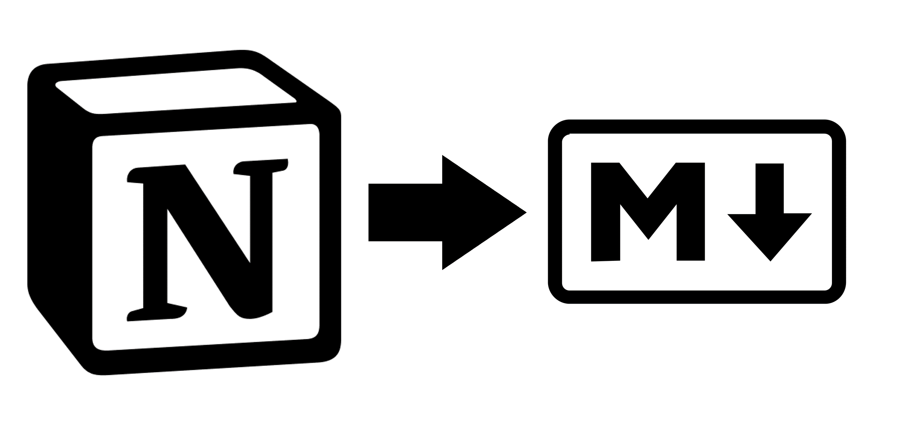

# Correct Notion to md/html converter

This project is a tool for converting Notion pages to Markdown files. Since Notion for some reason adds an excessive number of `strong` and `em` tags this tool just removes them, and gives you either the corrected html files or the cleaned up markdown, see `--help` for details.

## Project Structure

- `notion_html/`: Directory for the Notion HTML files to be fixed.
- `output_md/`: Directory for the fixed converted files

## Setup

1. Clone the repository.
2. Install [Poetry](https://python-poetry.org/docs/#installation) if you haven't already.
3. Install the project dependencies with Poetry:

```sh
poetry install
```

## Usage
1. Place the html files you want to fix into the `notion_html/` folder, you can also just put in the zip when you export.

2. Run the following command

```sh
poetry run python notion2md/main.py --help
```


### commands summary
| **command** | **description**                                                                  | **options**   | **default** |
|-------------|----------------------------------------------------------------------------------|---------------|-------------|
| `-ca`       | Remove the files you put in the conversion folder after everything is cleaned up | {true, false} | false       |
| `-to`       | Choose to either just get the corrected html files or get the markdown files     | {md, html}    | md          |

